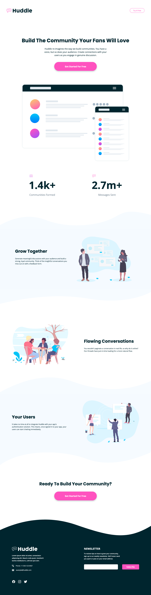

# Huddle landing page with curved sections solution

This is a solution to the [Huddle landing page with curved sections challenge on Frontend Mentor](https://www.frontendmentor.io/challenges/huddle-landing-page-with-curved-sections-5ca5ecd01e82137ec91a50f2). Frontend Mentor challenges help you improve your coding skills by building realistic projects.

## About the Project

The "Huddle Landing Page with Curved Sections" is a Frontend Mentor challenge designed to create a visually appealing landing page for Huddle, a community-building platform.

## Preview and Links

<b>Open Preview</b>

 

 

| [Live Demo URL](https://ionstici.github.io/huddle-landing-page-with-curved-sections) | [Frontend Mentor](https://www.frontendmentor.io/solutions/huddle-landing-page-with-curved-sections-XcGDlpD021) |
| ------------------------------------------------------------------------------------ | -------------------------------------------------------------------------------------------------------------- |

## Features

-   **Responsive Design:** Ensures the page adapts well to different screen sizes.
-   **Clean Layout:** A focus on a user-friendly and modern design for community engagement.

## Tech Stack

-   **HTML5:** For the semantic structure of the page.
-   **CSS3/Scss:** For styling.
